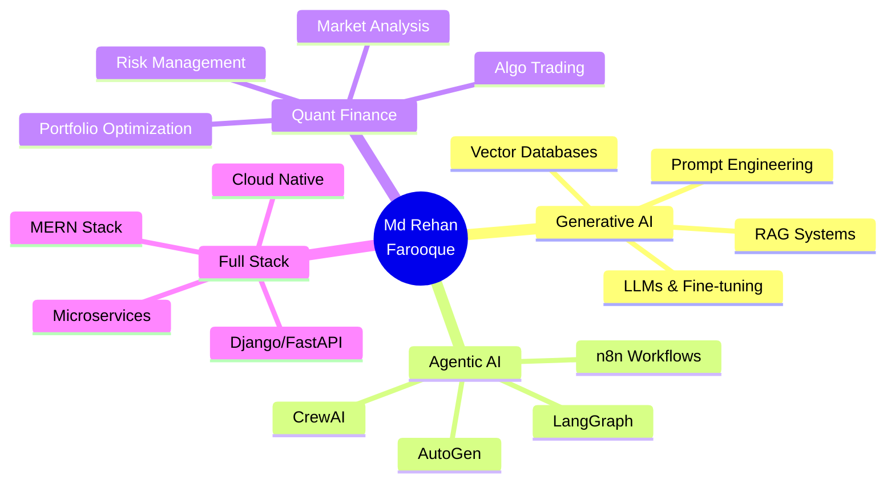

<!-- Animated Header -->

<!-- Typing Animation -->

 

<!-- Social Badges -->

  
  
  
  
  

<!-- Profile Views Counter -->

---

## 🚀 About Me

<table>
<tr>
<td width="50%">

### 🎓 **Education**
- **B.Tech** in AI & ML
- **Netaji Subhash Engineering College**
- Kolkata, India

### 🏆 **Achievements**
- ✅ **GATE 2025 Qualified** (Top 15%)
- ✅ **Best Performer** @ Elevate Labs
- ✅ **Multiple Chess Titles**
- ✅ **Hackathon Winner**

</td>
<td width="50%">

### 💡 **Expertise**
- 🤖 **Generative AI & LLMs**
- 📊 **Quantitative Finance**
- 🔗 **Blockchain & DeFi**
- 🌐 **Full-Stack Development**
- ☁️ **Cloud Architecture**

### 🎯 **Focus Areas**
- AI-powered Agentic Workflows
- Algorithmic Trading Systems
- RAG & Vector Databases
- Microservices Architecture

</td>
</tr>
</table>

---

## 🛠️ Tech Stack & Tools

### **🤖 AI/ML & Generative AI**

<table>
<tr>
<td align="center" width="100">

 TensorFlow
</td>
<td align="center" width="100">

 PyTorch
</td>
<td align="center" width="100">

 OpenCV
</td>
<td align="center" width="100">

 Scikit-learn
</td>
<td align="center" width="100">

 HuggingFace
</td>
<td align="center" width="100">

 LangChain
</td>
<td align="center" width="100">

 LlamaIndex
</td>
</tr>
<tr>
<td align="center" width="100">

 Gemini
</td>
<td align="center" width="100">

 OpenAI
</td>
<td align="center" width="100">

 Claude
</td>
<td align="center" width="100">

 Qdrant
</td>
<td align="center" width="100">

 Pinecone
</td>
<td align="center" width="100">

 ChromaDB
</td>
<td align="center" width="100">

 Semantic Kernel
</td>
</tr>
</table>

### **🔧 Agentic AI & Automation**

<table>
<tr>
<td align="center" width="100">

 n8n
</td>
<td align="center" width="100">

 Zapier
</td>
<td align="center" width="100">

 Make
</td>
<td align="center" width="100">

 CrewAI
</td>
<td align="center" width="100">

 LangGraph
</td>
<td align="center" width="100">

 AutoGen
</td>
<td align="center" width="100">

 AutoGPT
</td>
</tr>
</table>

### **💻 Programming Languages**

### **🌐 Full-Stack Development**

<table>
<tr>
<td align="center" width="100">

 React
</td>
<td align="center" width="100">

 Next.js
</td>
<td align="center" width="100">

 Vue.js
</td>
<td align="center" width="100">

 Node.js
</td>
<td align="center" width="100">

 Express
</td>
<td align="center" width="100">

 FastAPI
</td>
<td align="center" width="100">

 Django
</td>
</tr>
<tr>
<td align="center" width="100">

 Flask
</td>
<td align="center" width="100">

 Tailwind
</td>
<td align="center" width="100">

 MongoDB
</td>
<td align="center" width="100">

 PostgreSQL
</td>
<td align="center" width="100">

 Redis
</td>
<td align="center" width="100">

 GraphQL
</td>
<td align="center" width="100">

 Prisma
</td>
</tr>
</table>

### **☁️ Cloud & DevOps**

<table>
<tr>
<td align="center" width="100">

 AWS
</td>
<td align="center" width="100">

 GCP
</td>
<td align="center" width="100">

 Azure
</td>
<td align="center" width="100">

 Docker
</td>
<td align="center" width="100">

 Kubernetes
</td>
<td align="center" width="100">

 Terraform
</td>
<td align="center" width="100">

 Jenkins
</td>
</tr>
<tr>
<td align="center" width="100">

 GH Actions
</td>
<td align="center" width="100">

 Nginx
</td>
<td align="center" width="100">

 Kafka
</td>
<td align="center" width="100">

 RabbitMQ
</td>
<td align="center" width="100">

 Prometheus
</td>
<td align="center" width="100">

 Grafana
</td>
<td align="center" width="100">

 Elasticsearch
</td>
</tr>
</table>

### **🔗 Blockchain & Web3**

<table>
<tr>
<td align="center" width="100">

 Solidity
</td>
<td align="center" width="100">

 Ethereum
</td>
<td align="center" width="100">

 Polygon
</td>
<td align="center" width="100">

 Web3.js
</td>
<td align="center" width="100">

 Ethers.js
</td>
<td align="center" width="100">

 Truffle
</td>
<td align="center" width="100">

 Hardhat
</td>
</tr>
</table>

### **📊 Data Science & Quant Finance**

<table>
<tr>
<td align="center" width="100">

 Pandas
</td>
<td align="center" width="100">

 NumPy
</td>
<td align="center" width="100">

 Matplotlib
</td>
<td align="center" width="100">

 Seaborn
</td>
<td align="center" width="100">

 Plotly
</td>
<td align="center" width="100">

 Jupyter
</td>
<td align="center" width="100">

 Streamlit
</td>
</tr>
</table>

### **🔨 Tools & IDEs**

---

## 💼 What I Build

<table>
<tr>
<td width="50%">

### 🤖 **AI-Powered Systems**
- 🧠 LLM-based chatbots & assistants
- 🔍 RAG systems with vector databases
- 🎯 Agentic AI workflows with n8n
- 📊 Document intelligence platforms
- 🗣️ Voice AI applications

</td>
<td width="50%">

### 💹 **Quantitative Finance**
- 📈 Algorithmic trading bots
- 📉 Market prediction models
- 💰 Portfolio optimization
- 🔄 Automated trading strategies
- 📊 Financial data analysis

</td>
</tr>
<tr>
<td width="50%">

### 🌐 **Full-Stack Applications**
- ⚡ High-performance web apps
- 🎨 Modern React/Next.js frontends
- 🔧 RESTful & GraphQL APIs
- 🔐 Secure authentication systems
- 📱 Progressive web apps

</td>
<td width="50%">

### 🔗 **Blockchain Solutions**
- 💎 Smart contracts (Solidity)
- 🪙 DeFi protocols
- 🎮 NFT marketplaces
- ⛓️ Web3 integrations
- 🔐 Decentralized applications

</td>
</tr>
</table>

---

## 🎯 Current Focus

---

## 📈 GitHub Activity

---

## 🎨 Coding Activity

<!--START_SECTION:waka-->
<!--END_SECTION:waka-->

---

## 🌟 Featured Projects

<table>
<tr>
<td width="50%">
<h3 align="center">🚀 Full-Stack Agentic Voice Platform</h3>

AI-powered voice platform with CRM integrations, meeting automation, and intelligent conversations

</td>
<td width="50%">
<h3 align="center">🤖 Your Next Project</h3>

Something amazing is cooking...

</td>
</tr>
</table>

---

## 💡 Fun Facts

<table>
<tr>
<td width="33%" align="center">

 <b>Code Enthusiast</b> 
Building the future with AI
</td>
<td width="33%" align="center">

 <b>Chess Player</b> 
Strategy meets code
</td>
<td width="33%" align="center">

 <b>Continuous Learner</b> 
Always exploring new tech
</td>
</tr>
</table>

---

## 📬 Let's Connect!

### 💬 Open to collaborating on:
- 🤖 Generative AI & LLM projects
- 💹 Quantitative finance & trading systems
- 🌐 Full-stack applications
- 🔗 Blockchain & Web3 solutions
- ☁️ Cloud-native architectures

 

---

### 🎵 *"Code is like music; when it's good, it speaks for itself."*

  

### ⭐ **If you find my work interesting, drop a star on my repositories!** ⭐

 

<!-- Footer Wave -->

